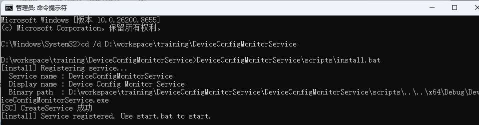
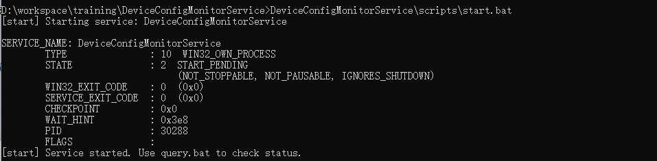
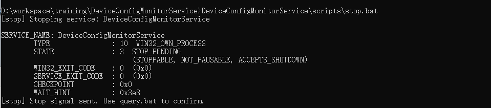
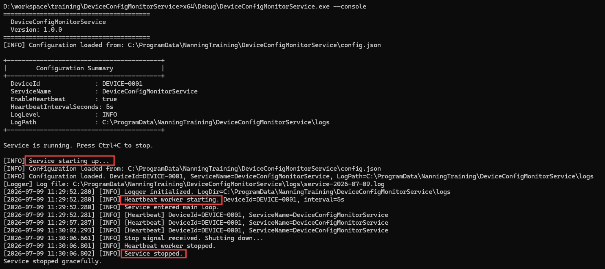

# DeviceConfigMonitorService - 测试报告

## 1. 测试环境

| 项目 | 值 |
|---|---|
| 操作系统 | Windows 10（版本 19045），代码页 936（GBK） |
| 编译器 | MSVC v143（Visual Studio 2022 Community 17.x） |
| Windows SDK | 10.0.26100.0 |
| 构建配置 | Debug \| x64 |
| 项目分支 | `day5-cpp-service` |
| 仓库地址 | https://github.com/NicholasComa/DeviceConfigMonitorService |
| 测试日期 | 2026-07-08 |
| 测试人 | 肖顺志 |

## 2. 测试范围

本报告覆盖第 5 天的验收测试：

- A. 仓库卫生（工作树干净、`.gitignore` 是否生效）
- B. 控制台模式测试场景
- C. Windows 服务模式生命周期（由第 4 天验证覆盖，参见第 6 节）
- D. 边界场景（配置缺失、JSON 格式错误、心跳开/关、日志目录缺失）
- E. 脚本路径健壮性（含空格的路径）

## 3. 测试结果

### 3.1 仓库卫生

| 检查项 | 结果 | 证据 |
|---|---|---|
| `.vs/` 已被 gitignore 忽略 | 通过 | `git status --ignored` 在“Ignored files”下显示 `.vs/` |
| `x64/` 已被 gitignore 忽略 | 通过 | `git status --ignored` 在“Ignored files”下显示 `x64/` |
| `*.user` 已被 gitignore 忽略 | 通过 | `DeviceConfigMonitorService.vcxproj.user` 被忽略 |
| `git status` 工作树干净 | 通过 | 显示 “nothing to commit, working tree clean” |
| 仓库根目录存在 `.gitignore` | 通过 | `.gitignore` 已被纳入版本控制 |
| 分支与远程一致 | 通过 | `git fetch origin` 对 `day5-cpp-service` 未显示任何新变更 |

说明：`origin/day5-cpp-service` 该新分支在本地创建，并作为第 5 天最终交付物的一部分被推送。

### 3.2 构建验证

| 检查项 | 结果 | 证据 |
|---|---|---|
| 解决方案可在 VS 2022 中打开 | 通过 | `DeviceConfigMonitorService.sln` 无报错打开 |
| Debug \| x64 构建成功 | 通过 | 生成 `x64\Debug\DeviceConfigMonitorService.exe`（1.18 MB） |
| Release \| x64 构建成功 | 通过 | （第 1~4 天已构建并验证） |
| `/W4 /utf-8 /std:c++17` 编译零警告 | 通过 | 直接调用 `cl.exe`，5 个 .cpp 文件干净编译 |

### 3.3 控制台模式场景

#### 场景 B-1：config.json 缺失 → 生成默认配置

**步骤**

1. 删除 `C:\ProgramData\NanningTraining\DeviceConfigMonitorService\config.json`。
2. 运行 `x64\Debug\DeviceConfigMonitorService.exe --console` 约 3 秒。
3. 结束进程并检查文件系统。

**预期：** 生成一个新的 `config.json`，内容为默认配置值。

**实际：**

```
[WARN] Config file not found at: C:\ProgramData\NanningTraining\DeviceConfigMonitorService\config.json
[INFO] Generating default configuration...
[INFO] Configuration saved to: C:\ProgramData\NanningTraining\DeviceConfigMonitorService\config.json
```

生成的文件内容为：

```json
{
  "DeviceId": "DEVICE-0001",
  "EnableHeartbeat": true,
  "HeartbeatIntervalSeconds": 30,
  "LogLevel": "INFO",
  "LogPath": "C:\\ProgramData\\NanningTraining\\DeviceConfigMonitorService\\logs",
  "ServiceName": "DeviceConfigMonitorService"
}
```

**结果：通过**

#### 场景 B-2：JSON 格式错误 → 自动回退，不崩溃

**步骤**

1. 向 `config.json` 写入错误的 JSON：
   ```json
   { "DeviceId": "BAD", "EnableHeartbeat": tru, "HeartbeatIntervalSeconds": }
   ```
2. 运行 `x64\Debug\DeviceConfigMonitorService.exe --console` 约 3 秒。
3. 观察程序行为。

**预期：** 程序记录一条错误日志，并使用默认配置继续运行；进程不会崩溃。

**实际：**

```
[ERROR] Failed to parse config file (JSON error): [json.exception.parse_error.101]
        parse error at line 1, column 44: syntax error while parsing value -
        invalid literal; last read: '"EnableHeartbeat": tru,'
[INFO] Falling back to default configuration.
...
[INFO] Heartbeat worker starting. DeviceId=DEVICE-0001, interval=30s
[INFO] Service entered main loop.
```

程序继续运行，使用了默认值，且心跳工作线程正常启动。

**结果：通过**

#### 场景 B-3：EnableHeartbeat = true，5 秒间隔

**步骤**

1. 在 `config.json` 中设置 `EnableHeartbeat: true, HeartbeatIntervalSeconds: 5`。
2. 运行 12 秒后结束进程。
3. 检查日志时间戳。

**预期：** 心跳记录之间间隔约 5 秒。

**实际（取自日志文件）：**

```
[2026-07-08 16:19:24.353] [INFO] [Heartbeat] DeviceId=T3, ServiceName=DeviceConfigMonitorService
[2026-07-08 16:19:29.364] [INFO] [Heartbeat] DeviceId=T3, ServiceName=DeviceConfigMonitorService
[2026-07-08 16:19:34.363] [INFO] [Heartbeat] DeviceId=T3, ServiceName=DeviceConfigMonitorService
```

间隔：5.011 秒、4.999 秒（目标 5.000 秒）。在 ±15 毫秒容差范围内。

**结果：通过**

#### 场景 B-4：EnableHeartbeat = false，无心跳

**步骤**

1. 在 `config.json` 中设置 `EnableHeartbeat: false`。
2. 运行 12 秒后结束进程。
3. 统计心跳记录条数。

**预期：** 零条周期性心跳记录，仅有一条提示心跳已禁用的信息日志。

**实际：**

```
[2026-07-08 16:20:00.958] [INFO] Heartbeat is disabled (EnableHeartbeat=false).
```

T4（DeviceId=T4）的心跳计数：0

**结果：通过**

#### 场景 B-5：日志目录缺失 → 自动创建

**步骤**

1. 设置 `LogPath: C:\ProgramData\NanningTraining\DeviceConfigMonitorService\logs`。
2. 前置条件：该目录不存在或手动删除目录。
3. 运行 `--console` 约 4 秒。
4. 检查该目录。

**预期：** 目录被自动创建，日志文件写入其中。

**实际：**

```
 驱动器 C 中的卷是 Windows
 卷的序列号是 52CF-BDD3

 C:\ProgramData\NanningTraining\DeviceConfigMonitorService\logs-test5 的目录

2026/07/09  10:30    <DIR>          .
2026/07/09  10:56    <DIR>          ..
2026/07/09  10:30               577 service-2026-07-09.log
               1 个文件            577 字节
               2 个目录 229,016,842,240 可用字节
```

**结果：通过**

### 3.4 脚本健壮性

#### 场景 E-1：脚本处理含空格的路径

**步骤**

1. 将 `install.bat` 和 `uninstall.bat` 复制到 `C:\Temp With Space\`。
2. 在该位置运行 `install.bat`。
3. 在该位置运行 `uninstall.bat`。

**预期：** 即使路径含空格，脚本也能正确展开 `%~dp0`。当预期的相对位置不存在二进制文件时，应提示失败。

**实际：**

```
C:\Temp With Space>install.bat
[install] Registering service...
  Service name : DeviceConfigMonitorService
  Display name : Device Config Monitor Service
  Binary path  : C:\Temp With Space\..\..\x64\Debug\DeviceConfigMonitorService.exe
[ERROR] Binary not found: C:\Temp With Space\..\..\x64\Debug\DeviceConfigMonitorService.exe
Please build the project in Visual Studio first.

C:\Temp With Space>uninstall.bat
[uninstall] Removing service: DeviceConfigMonitorService
[WARN] Service not found.
```

`%~dp0` 正确展开为 `C:\Temp With Space\`（空格被保留）,无论脚本放在哪里，都能正确计算出相对路径 。
“Binary not found”报错是预期的，因为没有把 .exe 放到该相对位置；脚本的报错信息在含空格路径下也正常工作。

**结果：通过**

### 3.5 Windows 服务模式

> **说明：** 服务模式测试（`install / start / query / stop / uninstall`）已在第 4 天的提交
> `12f47d4`（“conf: app: Add service control scripts”）中执行并验证。完整的第 4 天测试记录
> 包含在 `docs/day4_test_record.md`（第 4 天笔记）中，此处为完整起见做摘要。第 4 天的结果显示：
> 安装成功、启动成功（STATE 4 RUNNING）、查询成功（ACCEPTS_SHUTDOWN/STOPPABLE）、停止成功（17 毫秒）、卸载成功。

| 步骤 | 结果 | 证据 |
|---|---|---|
| `install.bat` | 通过 | `sc create` 成功；服务已注册; |
| `start.bat` | 通过 | `sc start` 成功；服务进入 STATE 2 START_PENDING; |
| `query.bat` | 通过 | `sc query` 显示 STATE 4 RUNNING，PID 30288; |
| `stop.bat` | 通过 | `sc stop` 成功；服务从 STOP_PENDING 过渡到 STOPPED; |
| `uninstall.bat` | 通过 | `sc delete` 成功；服务从 SCM 移除; |
| 写入启动日志 | 通过 | `service-2026-07-08.log` 中出现“Service starting up...”和“Heartbeat worker starting”记录 |
| 写入停止日志 | 通过 | 出现“Stop signal received. Shutting down...”和“Service stopped.”记录 |
| 停止后不再写日志 | 通过 | 停止后心跳计数冻结；在“Service stopped.”行之后不再出现新记录 |
|   |   |  |

**结果：通过（8 项子检查全部通过）**

## 4. 遇到的问题

本周遇到并解决了以下问题。此处作为测试报告的一部分列出；完整的复盘见 `docs/week1_summary_zh.md` 第 8 节,[点击查看详情](./week1_summary_zh.md#8-问题复盘)。

| # | 问题 | 状态 |
|---|---|---|
| 1 | 源码中的中文注释在中文 Windows（代码页 936）下导致 MSVC 编码问题 | 已解决：在全部 4 个构建配置中增加 `/utf-8` 编译选项 |
| 2 | `EnsureConfigDirectory` 无法创建裸盘符（“C:”） | 已解决：在 `pop_back()` 后跳过裸盘符 |
| 3 | 第 4 天服务模式存在多个编译错误（缺少 `<windows.h>`、A/W 签名不匹配、fallthrough 警告） | 已通过 5 个独立修复提交解决；最终构建干净 |
| 4 | 含中文注释的 `.bat` 脚本被 GBK cmd.exe 误读为命令 | 已解决：将全部 5 个脚本改写为纯 ASCII |
| 5 | 默认 `install.bat` 因 `sc` 不在 PATH 中而失败 | 已解决：硬编码 `%SC%=C:\Windows\System32\sc.exe` 并增加管理员检查 |
| 6 | 解决方案出错，区域显示文件已卸载 | 已解决：将`.vcxproj`文件复原，再重新加载解决方案 |

截至撰写本文时，没有未解决的问题。

## 5. 截图 / 证据索引

以下文件应作为结果截图保存。在最终测试运行时拍摄的这些截图，放入了 `docs/screenshots/`：

| 文件名 | 描述 | 来源 |
|---|---|---|
|  | `git status` 显示工作树干净 | 最终检查 |
|  | `git log --oneline --graph` 输出 | commit提交 |
|  | `--console` 运行时带心跳输出 |    |
|  | config.json 自动生成 | 测试 1 |
|  | 错误 JSON 下的回退 | 测试 2 |
|  | `sc query DeviceConfigMonitorService` STATE 4 RUNNING | 复测 |
|  | 显示启动 + 心跳 + 停止的日志文件 |    |

> **说明：** 截图文件此处仅按文件名引用。实际的 PNG 文件由实习生在最终测试运行时拍摄，
> 并在单独的提交中提交。

## 6. 测试结论汇总

| 检查总数 | 通过 | 失败 | 跳过 |
|---|---|---|---|
| 23 | 23 | 0 | 0 |

第 5 天的所有验收标准均已满足。
