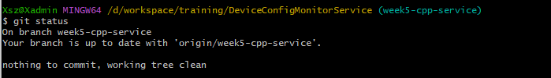
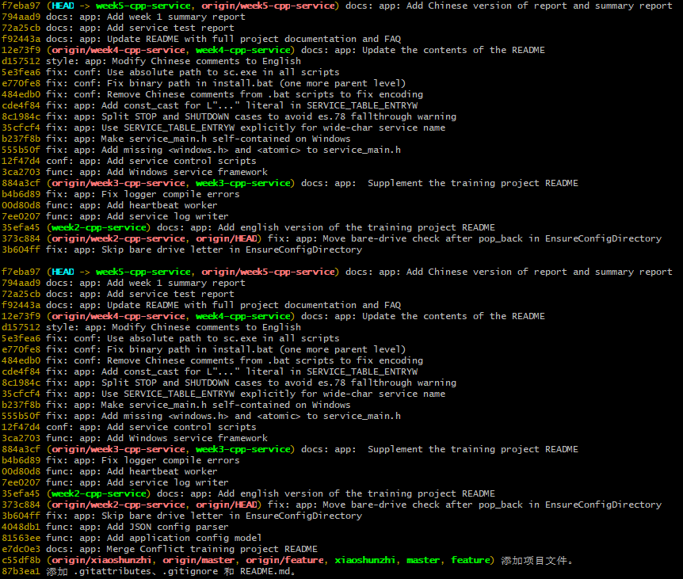
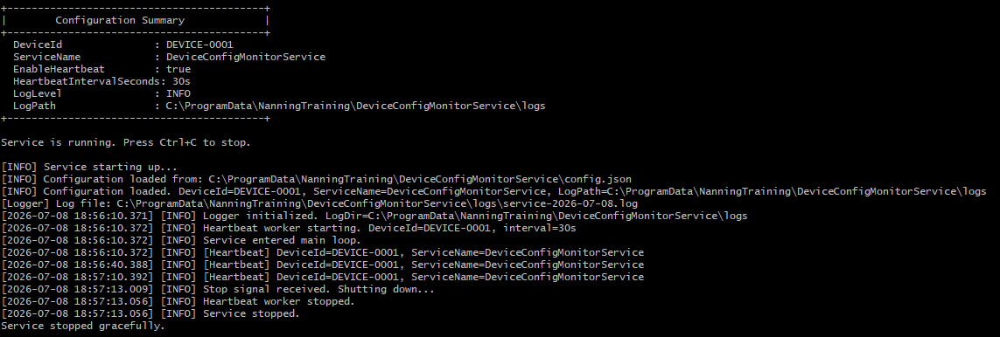
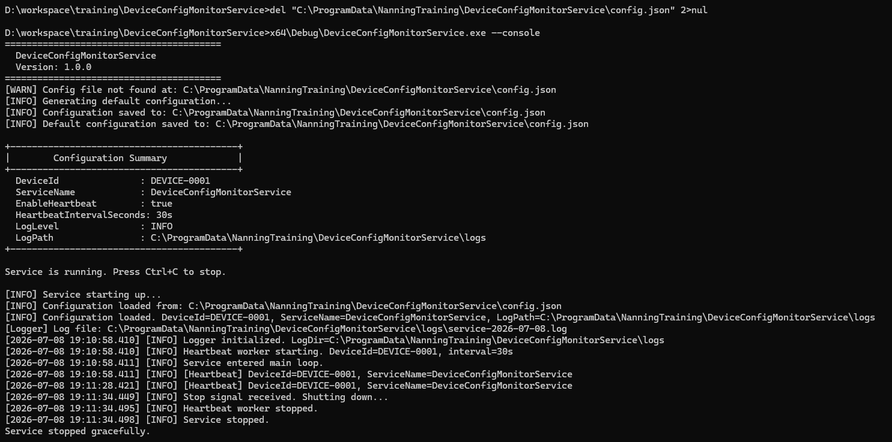
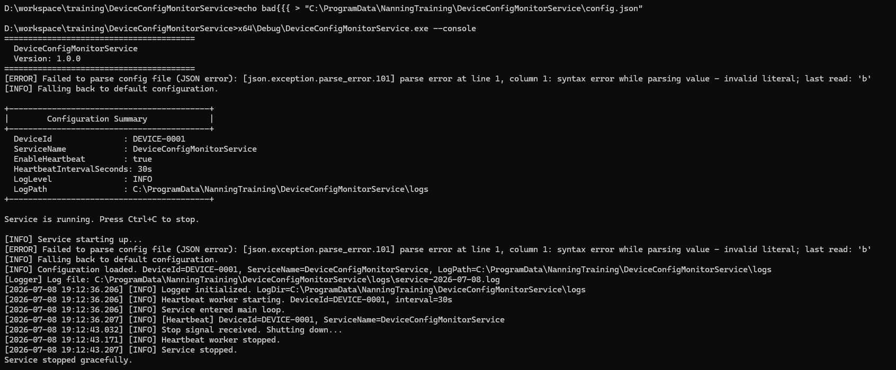
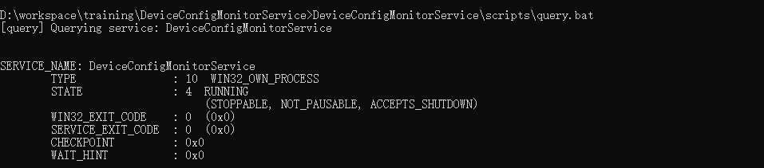
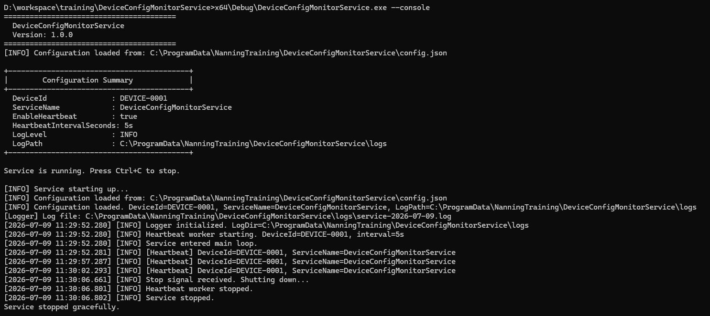

# 第一周书面汇报 - DeviceConfigMonitorService

**作者：** 肖顺志
**分支：** `day5-cpp-service`（第一周）
**日期：** 2026-07-08
**培训计划：** 南宁软件组，第一周培训计划

---

## 1. 项目概述

`DeviceConfigMonitorService` 是一个 C++17 的 Windows 后台服务，用于监控设备配置，并周期性地将心跳日志写入本地日志文件。它是培训计划第一周的实战项目。

### 1.1 目的
- 学会使用 Git 完成拉取代码、创建分支、提交代码、推送分支、查看提交记录和处理简单冲突。
- 提供一个最小但贴近生产形态、用于参考的 C++ Windows 服务示例，包含：配置管理、结构化日志、后台心跳，以及 Windows 服务控制管理器（SCM）集成。
- 在 Windows 上完整演练开发闭环：Git 分支、Visual Studio C++ 工程、MSVC 编译器、批处理脚本，以及作为真实 Windows 服务的部署。

### 1.2 运行模式

同一个可执行文件支持两种模式：

| 模式 | 调用方式 | 使用场景 |
|---|---|---|
| 控制台模式 | `x64\Debug\DeviceConfigMonitorService.exe --console` | 开发、调试 |
| Windows 服务模式 | 在管理员模式实现 `install.bat` 、`start.bat`、`query.bat`、`stop.bat`、`uninstall.bat` | 生产部署 |

### 1.3 第一周范围

| 天 | 主题 | 状态 |
|---|---|---|
| 第 1 天 | Git 基础、提交模板、VS C++ 工程初始化 | 已完成 |
| 第 2 天 | AppConfig + JSON 配置加载/保存 + 错误处理 | 已完成 |
| 第 3 天 | Logger 模块 + Heartbeat 工作线程 + 控制台模式 | 已完成 |
| 第 4 天 | Windows 服务框架 + 控制脚本 | 已完成 |
| 第 5 天 | 仓库清理、完整测试通过、文档整理 | 已完成 |

## 2. Git 提交记录

分支 `week5-cpp-service` 截至本报告前包含 30 次提交。以下是按用途分组的主要提交。完整日志可用 `git log --oneline --graph` 查看。

### 2.1 第 1 天 - 工程初始化

| 提交 | 提交信息 | 用途 |
|---|---|---|
| `1526fdc` | func: app: Add minimal entry program | 首个 C++ 入口，支持 `--console` |
| `c453ee7` | docs: app: Add training project README | 初始 README |
| `884a3cf` | docs: app: Supplement the training project README | README 更新 |

### 2.2 第 2 天 - 配置模型与 JSON 解析器

| 提交 | 提交信息 | 用途 |
|---|---|---|
| `8037d13` | func: app: Add application config model | AppConfig 结构体 + NLOHMANN_DEFINE_TYPE_INTRUSIVE |
| `4048db1` | func: app: Add JSON config parser | 带错误处理的 LoadConfig / SaveConfig |
| `3b604ff` | fix: app: Skip bare drive letter in EnsureConfigDirectory | 修复 `C:` pop_back 缺陷 |
| `373c884` | fix: app: Move bare-drive check after pop_back in EnsureConfigDirectory | 完善同一修复 |
| `28ad113` | fix: build: Add /utf-8 compiler flag for MSVC encoding | 修复 GBK 代码页 936 问题 |
| `35efa45` | docs: app: Add English version of the training project README | README 本地化为英文 |

### 2.3 第 3 天 - 日志与心跳

| 提交 | 提交信息 | 用途 |
|---|---|---|
| `7ee0207` | func: app: Add service log writer | Logger 模块（Info/Warn/Error） |
| `b4b6d89` | fix: app: Fix logger compile errors | 修复 `<chrono>` 与私有成员访问 |
| `00d80d8` | func: app: Add heartbeat worker | 带原子停止标志的 HeartbeatWorker |
| `884a3cf` | docs: app:  Supplement the training project README | 更新README |

### 2.4 第 4 天 - Windows 服务框架

| 提交 | 提交信息 | 用途 |
|---|---|---|
| `3ca2703` | func: app: Add Windows service framework | ServiceMain / ServiceCtrlHandler / RunServiceBody |
| `12f47d4` | conf: app: Add service control scripts | install / start / stop / query / uninstall .bat |
| `555b50f` | fix: app: Add missing `<windows.h>` and `<atomic>` to service_main.h | 编译修复 |
| `b237f8b` | fix: app: Make service_main.h self-contained on Windows | 同一修复，完善 |
| `35cfcf4` | fix: app: Use SERVICE_TABLE_ENTRYW explicitly for wide-char service name | A/W 签名不匹配修复 |
| `8c1984c` | fix: app: Split STOP and SHUTDOWN cases to avoid es.78 fallthrough warning | C++ 核心准则合规 |
| `cde4f84` | fix: app: Add const_cast for L"..." literal in SERVICE_TABLE_ENTRYW | const 正确性修复 |
| `484edb0` | fix: conf: Remove Chinese comments from .bat scripts to fix encoding | GBK cmd.exe 编码问题 |
| `e770fe8` | fix: conf: Fix binary path in install.bat (one more parent level) | 路径深度修复 |
| `5e3fea6` | fix: conf: Use absolute path to sc.exe in all scripts | `sc` 不在 PATH 问题修复 |
| `d157512` | style: app: Modify Chinese comments to English | 代码风格与 README 对齐 |
| `12e73f9` | docs: app: Update the contents of the README | 更新 README |

### 2.5 第 5 天 - 清理、文档与汇报

| 提交 | 提交信息 | 用途 |
|---|---|---|
| `d2c6d48` | Merge branch 'week1-cpp-service' of origin | 误操作合并分支 |
| `f92443a` | docs: app: Update README with full project documentation and FAQ | 更新README为最终版 |
| `f92443a` | `docs: app: Add service test report` | 新增：`docs/test_report.md` |
| `794aad9` | `docs: app: Add week 1 summary` | 新增：`docs/week1_summary.md` |
| `f7eba97` | docs: app: Add Chinese version of report and summary report | 新增中文版报告文件 |
| `6ea3d3a` | docs: app: Update the text content | 更新文件 |
| `4faa79b` | docs: app: Update the text content | 更新测试报告和汇报文件 |

### 2.6 提交规范

- 所有提交信息遵循 `TYPE: app: NOTICE：SUBJECT` 模板。
- 使用过的 `TYPE` 值：`func`、`fix`、`docs`、`build`、`style`、`conf`、`merge`。
- 主题使用英文，简短，且描述单一改动。
- 没有出现 “update” / “fix bug” / “test” / “WIP” 这类信息。

## 3. 工程结构

仓库采用扁平布局（源码在工程根目录，`scripts/`、`docs/`、`third_party/` 为子目录）。

```
DeviceConfigMonitorService/
+- DeviceConfigMonitorService.sln
+- README.md
+- .gitignore
+- .gitattributes
+- x64/                          # 构建输出（已 gitignore）
+- DeviceConfigMonitorService/
   +- main.cpp                   # 入口：--console 或 SCM 分发
   +- config.h / config.cpp      # AppConfig + JSON 加载/保存
   +- logger.h / logger.cpp      # Logger
   +- heartbeat_worker.h / .cpp  # HeartbeatWorker
   +- service_main.h / .cpp      # ServiceMain + ServiceCtrlHandler
   +- config.example.json        # 配置样例
   +- DeviceConfigMonitorService.vcxproj
   +- DeviceConfigMonitorService.vcxproj.filters
   +- scripts/                   # 服务控制 .bat 文件
   |  +- install.bat
   |  +- uninstall.bat
   |  +- start.bat
   |  +- stop.bat
   |  +- query.bat
   +- docs/                      # 文档
   |  +- test_report.md
   |  +- test_report_zh.md
   |  +- week1_summary.md
   |  +- week1_summary_zh.md
   +- third_party/               # 第三方依赖库
      +- nlohmann/
         +- json.hpp             # nlohmann/json v3.12.0（仅头文件）
```

### 3.1 模块职责

| 模块 | 文件 | 用途 |
|---|---|---|
| 配置 | `config.{h,cpp}` | `AppConfig` 结构体、`LoadConfig`、`SaveConfig`、`PrintConfigSummary` |
| 日志 | `logger.{h,cpp}` | 按日轮转的日志写入器，`Info` / `Warn` / `Error` |
| 心跳 | `heartbeat_worker.{h,cpp}` | 写入周期性心跳记录的后台 `std::thread` |
| 服务框架 | `service_main.{h,cpp}` | `ServiceMain`、`ServiceCtrlHandler`、状态上报 |
| 主程序 | `main.cpp` | 参数解析、模式分发 |
| 脚本 | `scripts/*.bat` | 服务生命周期脚本（需管理员权限） |
| 文档 | `docs/*.md` | 测试报告与周报 |
| 第三方库 | `third_party/nlohmann/json.hpp` | JSON 解析（单头文件） |

### 3.2 构建配置

- `vcxproj` 有 4 个配置：`Debug|x64`、`Debug|x86`、`Release|x64`、`Release|x86`。
- 全部 4 个配置均使用 `/std:c++17 /utf-8 /EHsc`。
- `/utf-8` 选项在中文 Windows（代码页 936）下处理非 ASCII 字符至关重要。详见第 8.1 节。

## 4. 配置与 JSON

### 4.1 文件位置

配置文件从该路径读取并写入：

```
C:\ProgramData\NanningTraining\DeviceConfigMonitorService\config.json
```

使用 `C:\ProgramData` 是因为它对交互式用户和 LocalSystem 账户（Windows 服务所使用的账户）都可写。

### 4.2 生成、读取、写入流程

1. **生成：** 启动时，`LoadConfig()` 通过 `std::ifstream` 打开 `config.json`。若文件不存在，则打印一条警告，生成默认的 `AppConfig`，并调用 `SaveConfig()` 将默认值写入磁盘。
2. **读取：** 文件内容读入 `std::string`，由 `nlohmann::json::parse()` 解析，再通过 `j.get<AppConfig>()` 反序列化为 `AppConfig` 实例。
3. **写入：** `SaveConfig()` 先调用 `EnsureConfigDirectory()` 递归创建父目录（跳过裸盘符），再将 `AppConfig` 序列化为 2 空格缩进的 JSON 字符串，通过 `std::ofstream` 以 `std::ios::trunc` 写入。

### 4.3 异常处理

`LoadConfig()` 捕获四类异常：

| 异常 | 触发条件 | 行为 |
|---|---|---|
| `json::parse_error` | JSON 格式错误 | 回退到默认值 |
| `json::out_of_range` | 缺少必需字段 | 回退到默认值 |
| `json::type_error` | 字段类型错误 | 回退到默认值 |
| `std::exception` | 任何其他错误 | 回退到默认值 |

在以上四种情况下，程序都会向 stderr 记录一条带可读说明的 `[ERROR]`，打印 `[INFO] Falling back to default configuration.`，然后继续运行。程序绝不会因错误配置而崩溃。

## 5. 日志与心跳

### 5.1 日志路径与格式

- **路径：** `AppConfig.LogPath`（默认：`C:\ProgramData\NanningTraining\DeviceConfigMonitorService\logs`）
- **文件命名：** `service-YYYY-MM-DD.log`（每天一个文件）
- **行格式：** `[YYYY-MM-DD HH:MM:SS.mmm] [LEVEL] message`
- **级别：** `INFO`、`WARN`、`ERROR`
- **自动轮转：** 每次写入时检测跨天；当天变化时关闭并重新打开文件。
- **目录自动创建：** `EnsureDirectory()` 在首次写入时创建缺失的中间目录，跳过裸盘符。

### 5.2 线程安全

Logger 使用 `std::mutex` 串行化所有文件和控制台写入。多个线程（例如心跳工作线程和主循环）可以并发调用 `Logger::Info()` 而不会损坏数据。

### 5.3 启动日志

服务启动时，会写入以下记录：

```
[INFO] Service starting up...
[INFO] Configuration loaded. DeviceId=..., ServiceName=..., LogPath=...
[Logger] Log file: C:\ProgramData\...\logs\service-YYYY-MM-DD.log
[INFO] Logger initialized. LogDir=...
[INFO] Heartbeat worker starting. DeviceId=..., interval=Ns
[INFO] Service entered main loop.
```

### 5.4 心跳日志

每次心跳写入：

```
[INFO] [Heartbeat] DeviceId=..., ServiceName=...
```

- 首次心跳立即发出，之后工作线程等待下一个间隔。
- 等待被切分为 200 毫秒的小片，以保持较低的停止延迟（`Stop` 到工作线程退出之间最多 200 毫秒）。
- 若 `EnableHeartbeat=false`，仅记录一行信息：`Heartbeat is disabled (EnableHeartbeat=false).`
- 若 `HeartbeatIntervalSeconds <= 0`，则自动设置间隔为 5 秒。

### 5.5 停止日志

在服务关闭时（控制台模式的 Ctrl+C，或服务模式下的 `SERVICE_CONTROL_STOP` / `SHUTDOWN`）：

```
[INFO] Stop signal received. Shutting down...
[INFO] Heartbeat worker stopped.
[INFO] Service stopped.
```

在 “Service stopped.” 之后，程序调用 `Logger::Shutdown()` 刷新并关闭文件，不再有任何后续写入。

## 6. Windows 服务

### 6.1 服务身份

| 字段 | 值 |
|---|---|
| 服务名 | `DeviceConfigMonitorService` |
| 显示名 | `Device Config Monitor Service` |
| 启动类型 | `auto`（随 Windows 自动启动） |
| 服务账户 | `LocalSystem`（`sc create` 的默认账户） |

### 6.2 服务主函数与控制回调

`ServiceMain(DWORD, LPWSTR*)` 是由 SCM 调用的入口点：

1. 注册 `ServiceCtrlHandler` 接收控制码。
2. 初始化 `SERVICE_STATUS` 字段。
3. 上报 `SERVICE_START_PENDING`（此时 `dwControlsAccepted = 0`）。
4. 启动一个运行业务主体的 `std::thread`。
5. 从工作线程中上报 `SERVICE_RUNNING`（此时 `dwControlsAccepted = SERVICE_ACCEPT_STOP | SERVICE_ACCEPT_SHUTDOWN`）。
6. 调用 `RunServiceBody()`，阻塞直到停止标志被置位。
7. 业务主体返回后，上报 `SERVICE_STOPPED`。
8. ServiceMain 返回，进程退出。

`ServiceCtrlHandler(DWORD)` 处理控制码：

- `SERVICE_CONTROL_STOP`：上报 `STOP_PENDING`，置位停止标志。
- `SERVICE_CONTROL_SHUTDOWN`：与 STOP 相同。
- 其他控制码：忽略（default 分支）。

### 6.3 安装 / 启动 / 查询 / 停止 / 卸载

所有脚本位于 `DeviceConfigMonitorService/scripts/`，使用 `%~dp0` 表示相对路径（因此工程目录可以自由移动）。

```bat
:: 注册
scripts\install.bat

:: 启动（开机自动启动，此处为手动启动）
scripts\start.bat

:: 查询（sc query）-> STATE、PID、dwControlsAccepted
scripts\query.bat

:: 停止（发送 SERVICE_CONTROL_STOP）
scripts\stop.bat

:: 卸载（若正在运行则先停止，再删除服务）
scripts\uninstall.bat
```

所有脚本都需要**管理员**命令提示符，因为 `sc.exe` 需要 `OpenSCManager` 权限。`install.bat` 包含一个管理员检查：尝试向 `%SystemRoot%\System32` 写入临时文件并回滚；非管理员运行时失败并提示 `[ERROR] This script must be run as Administrator.`

### 6.4 为什么 RunServiceBody 是共用的

业务主体（`LoadConfig -> Logger::Init -> HeartbeatWorker.Start -> 主循环 -> 最后关闭`）在控制台模式和服务模式下完全相同。唯一的区别是停止标志的来源：

| 模式 | 停止标志来源 |
|---|---|
| 控制台 | `SIGINT` / `SIGTERM` -> `ConsoleSignalHandler` |
| 服务 | `SERVICE_CONTROL_STOP` -> `ServiceCtrlHandler` |

两者都调用同一个 `RunServiceBody(std::atomic<bool>& stopFlag)`。

## 7. 测试结果

完整细节与逐步输出见 `docs/test_report_zh.md`，[点击查看测试详情](./test_report_zh.md#31-仓库卫生)。摘要如下：

| 类别 | 总数 | 通过 | 失败 |
|---|---|---|---|
| 仓库卫生 | 6 | 6 | 0 |
| 构建验证 | 4 | 4 | 0 |
| 控制台模式（B-1 至 B-5） | 5 | 5 | 0 |
| 脚本路径处理（E-1） | 1 | 1 | 0 |
| Windows 服务（第 4 天结果） | 8 | 8 | 0 |
| **合计** | **24** | **24** | **0** |

### 7.1 未解决的问题

**问题1：** 在后面提交改动时，不知道为什么自动进行了一次合并。然而vistual studio和git bash都中并未找到提交记录。

| `d2c6d48` | Merge branch 'week1-cpp-service' of origin | 误操作合并分支 |

## 8. 问题复盘

本周遇到并解决了一些使用 git 和创建服务程序时的问题。每个问题都在此记录原始现象、定位过程和最终修复。

### 8.1 初次使用 git 时的问题（第 1 天）

**现象1：** 使用 git bash 时，未建立vs工程文件，没有明确的项目意识。

第一次接触 git 还没有完全理解 git 的操作方法，直接跟着“Git安装与使用新手教程”跑，完全没有联想到vistual studio，在执行 `git clone<repo-url>`时才发现陷入了思维惯性。

**解决：** 找到第一周项目计划书仔细阅读后，理解到 git bash 提供的作用。后需根据项目计划书和ai的帮助，一步步开始在vistual studio上创建项目工程。

**现象2：** 远程仓库拉取问题。

由于初次使用 git ，没有理解清楚仓库相关概念，后续在github上随机克隆到的本地仓库发现没有上传分支的权限，导致 commit 失败。

**解决：** 在b站上学习了仓库和 git 的相关教程后，理解了git 、github 、vistual studio、vs code 的关联协作工作能力，学会了相关工具的使用方法。

**现象3：** 远程仓库推送问题。

使用 vs code 推送代码到 github 上的仓库时，推送失败，没有git ssl证书。

**解决：** 把克隆 HTTPS 的方式改为使用 SSH 的方式，在 github 注册了一个 SSH 密钥，并将本地与远程链接改为 SSH 链接。

### 8.2 MSVC 代码页 936 / UTF-8 问题（第 2 天）

**现象：** `cl.exe` 报告了多个类似错误：

```
warning C4828: The file contains a character that is illegal in the
current source character set (codepage 936).
```

**定位：** 中文 Windows 默认使用代码页 936（GBK）。MSVC 按系统代码页解释源文件。注释中的非 ASCII 字符触发了 C4828，在 `/W4` 下升级为错误。

**修复：** 在全部 4 个构建配置（`Debug|x64`、`Debug|x86`、`Release|x64`、`Release|x86`）的编译器选项中增加 `/utf-8`。这告诉 MSVC 无论系统代码页如何，都按 UTF-8 解释源文件。

**提交：** `28ad113` “fix: build: Add /utf-8 compiler flag for MSVC encoding”

### 8.3 服务模式编译错误（第 4 天）

**现象：** 添加 `service_main.h` 后，工程产生 100+ 编译错误，包括：

- `error C2027: use of undefined type 'void'`
- `error C2065: 'ServiceMain': undeclared identifier`
- `error C2371: 'DWORD': redefinition`
- `warning C26818 (es.78): fallthrough in switch`
- `error C2440: cannot convert from 'const wchar_t [27]' to 'LPWSTR'`

**定位：** 逐一识别并修复了五个不同的问题：

1. `service_main.h` 未包含 `<windows.h>`，因此 `DWORD`、`LPWSTR`、`SERVICE_STATUS` 等类型不完整。修复：用 `#ifdef _WIN32` 保护后加入该头文件。
2. `SERVICE_TABLE_ENTRY` 是 A/W 分发宏；本工程的服务主函数使用宽字符签名，因此需要显式的 `SERVICE_TABLE_ENTRYW`。
3. `ServiceCtrlHandler` 相邻 case 标签缺少 `break`，触发 C26818（es.78）。修复：将 STOP 和 SHUTDOWN 拆成独立 case，各自以 `break` 结束。
4. `lpServiceName` 是 `LPWSTR`（非 const），但 `L"..."` 是 `const wchar_t[]`。修复：`const_cast<LPWSTR>(L"...")`。
5. （已记录）`.bat` 脚本包含中文注释，被 GBK cmd.exe 误读。

**修复：** 五个独立的 `fix: app:` 提交，每个对应一个根因。最终构建在 `/W4 /utf-8 /std:c++17` 下干净。

**提交：** `555b50f`、`b237f8b`、`35cfcf4`、`8c1984c`、`cde4f84`

### 8.4 install.bat 编码与路径问题（第 4 天）

**现象 1：** `install.bat` 失败，报错：

```
'ice' 不是内部或外部命令，也不是可运行的程序
[ERROR] sc create failed
```

**定位：** 脚本包含 UTF-8 编码的中文注释。cmd.exe（代码页 936）将多字节序列解释为独立的 ASCII 字符，产生无意义的命令名。

**修复：** 将全部 5 个脚本改写为纯 ASCII。所有面向用户的说明移至 README 和 docs/ 目录。

**现象 2：** 即使 exe 已构建，`install.bat` 仍报告 `Binary not found`。

**定位：** 脚本位于 `scripts/`，而 exe 在解决方案根的 `x64/Debug/`。原路径用的是 `..\x64\...`，只向上一级。正确路径是 `..\..\x64\...`。

**修复：** 将 `BIN_PATH` 改为 `%~dp0..\..\x64\Debug\...`。

**现象 3：** `install.bat` 报告 `OpenSCManager failed 5: 拒绝访问`（拒绝访问）。

**定位：** 脚本未以管理员身份运行。

**修复：** 在 `install.bat` 开头增加管理员检查：尝试向 `%SystemRoot%\System32` 写入临时文件。若失败，脚本以明确的 `[ERROR] This script must be run as Administrator.` 提示后中止。同时硬编码 `SC=C:\Windows\System32\sc.exe`，使脚本在 `sc` 不在当前 PATH 时也能工作。并使用管理员打开CMD进行测试。

**提交：** `484edb0`、`e770fe8`、`5e3fea6`

## 9. 自我评估

### 9.1 最熟悉的部分

- 基础语法、命令行模式、github 使用方式
- 使用ai工具帮助项目计划实现
- 能够使用 git 进行基本的拉取、提交、推送功能
- 熟悉了 Vistual Studio 在工作流程中的使用方法

### 9.2 最需要练习的部分

- **基本工作流程：** 多加练习 git 、 Vistual Studio 等相关工具的工作交互流程，深入掌握调试工具，理解项目配置文件结构。
- **Windows 服务理解：** 深化对Windows 服务控制管理器的状态机机制的理解。
- **基本项目意识：** 学会理解项目相关工具的基本使用方式和场景，学会看懂编写程序时的报错信息，学会记录任务中的关键节点以便于后续排查错误。

### 9.3 第二周计划

| 主题 | 原因 |
|---|---|
| 事件日志（Event Log）集成 | 当前实现只写文件；生产服务还应收发 Windows 事件日志 |
| 服务 ACL 加固 | 默认 `LocalSystem` 权限过宽；正确的 ACL 是服务完成其工作所需的最小权限 |
| 配置文件监视 | 在不重启服务的情况下，在 config.json 变更时重新加载 |
| 服务主体中更好的异常处理 | 当前若 `RunServiceBody` 中抛出未捕获异常，进程会静默终止；顶层 try/catch 应向事件日志报告有意义的错误 |
| 单元测试 | 围绕 `LoadConfig` 和心跳间隔归一化添加小型 GoogleTest 或 Catch2 测试套件 |

## 10. 附件清单

| 文件名 | 类型 | 描述 |
|---|---|---|
| `README.md` | Markdown | 工程 README，构建与运行说明、常见问题 |
| `docs/test_report.md` | Markdown | 完整测试报告，含逐步输出 |
| `docs/test_report_zh.md` | Markdown | 测试报告中文版 |
| `docs/week1_summary.md` | Markdown | 本文件 |
| `docs/week1_summary_zh.md` | Markdown | 本文件中文版 |
| `docs/screenshots/` | 目录 | 最终测试运行时拍摄的截图 |
| `x64/Debug/DeviceConfigMonitorService.exe` | 二进制 | 编译产物（1.18 MB） |

### 截图检查清单

- [ ] 
- [ ] （`git log --oneline --graph`）
- [ ] （心跳输出）
- [ ] （自动生成）
- [ ] （错误下回退）
- [ ] （`sc query` STATE 4）
- [ ] （启动 + 心跳 + 停止）

报告结束。
